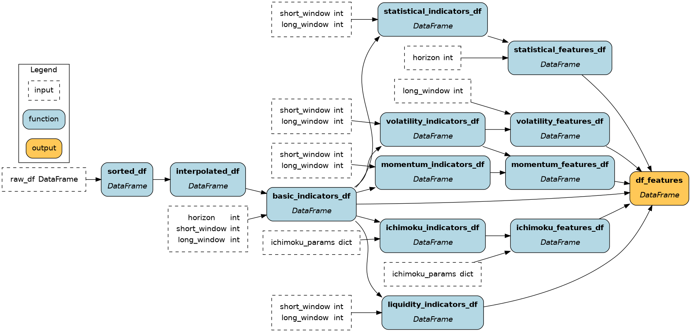

# Stock Market Analytics

A production-grade machine learning project for quantitative finance, implementing modern MLOps and software architecture practices for scalable and rigorous stock market prediction and analysis.

## Table of Contents

- [Overview](#overview)
- [Key Features](#key-features)
- [Architecture](#architecture)
  - [Design Philosophy](#design-philosophy)
  - [Module Organization](#module-organization)
  - [Data Flow](#data-flow)
- [Technical Highlights](#technical-highlights)
  - [Functional Feature Engineering](#functional-feature-engineering)
  - [Protocol-Driven Design](#protocol-driven-design)
  - [Production-Ready Infrastructure](#production-ready-infrastructure)
  - [Quality Assurance](#quality-assurance)
  - [CI/CD](#cicd-pipeline)
- [Installation](#installation)
- [Usage Guide](#usage-guide)
  - [Data Collection](#data-collection)
  - [Feature Engineering](#feature-engineering)
  - [Model Training](#model-training)
  - [Code Organization](#code-organization)

## Overview

This platform demonstrates enterprise-grade quantitative finance engineering through a complete machine learning pipeline for stock market analysis. The system showcases modern software architecture principles including DAGs in a functional paradigm, protocol-driven design, and production-ready MLOps practices.

The platform predicts stock log returns using multi-quantile regression with uncertainty quantification, implemented through a sophisticated three-layer architecture that separates business logic, workflow orchestration, and data processing concerns.

## Key Features

- **🏗️ Three-Layer Architecture**: Clean separation between core business logic, reusable workflow steps, and orchestration flows
- **📊 Advanced Feature Engineering**: Functional-based-DAGs approach using [Hamilton](https://hamilton.apache.org/) for 50+ technical indicators and statistical features
- **🎯 Multi-Quantile Prediction**: CatBoost-based uncertainty quantification with conformal prediction calibration
- **⚡ High-Performance Data Processing**: Polars-based vectorized operations with symbol-aware computations, allowing high speed and preventing data leakage
- **🔒 Type-Safe Configuration**: Centralized Pydantic configuration system with validation and environment integration
- **📈 Production MLOps**: Metaflow orchestration with Weights & Biases experiment tracking
- **🛡️ Fast Data Collection and High Quality Assurance**: Comprehensive **parallelized** validation system ensuring model reliability
- **🧪 Protocol-Driven Design**: Interface-based architecture enabling component interchangeability

## Architecture

### Design Philosophy

The system implements a **domain-driven, layered architecture** optimized for maintainability, testability, and production deployment:

```
🏛️ Three-Layer Architecture
├── 🔧 Core Layer      → Pure business logic, domain-specific algorithms
├── 📋 Steps Layer     → Reusable workflow functions, integration logic  
└── ⚙️ Flow Layer      → Metaflow orchestration, error handling, scaling
```

This design ensures:
- **Modularity & Separation of Concerns**: Each layer has distinct responsibilities
- **Reusability & Extensibility**: Core components work across different workflows
- **Maintainability & Readability**: Separation of steps and flows allows to understand and change functions easily

### Module Organization

```
src/stock_market_analytics/
├── config.py                    # 🔧 Type-safe centralized configuration
├── main.py                      # 📋 CLI entry point
├── data_collection/             # 📊 Data ingestion pipeline
│   ├── collectors/              #   🔧 Core: YFinance, protocol-based collectors
│   ├── processors/              #   🔧 Core: Data quality validation
│   ├── models/                  #   🔧 Core: Pydantic schemas & quality rules
│   ├── collection_steps.py      #   📋 Steps: Workflow step functions
│   └── batch_collection_flow.py #   ⚙️ Flow: Metaflow orchestration
├── feature_engineering/         # 🧮 Feature computation pipeline
│   ├── feature_pipeline.py      #   🔧 Core: Hamilton functional features
│   ├── feature_steps.py         #   📋 Steps: Feature workflow functions
│   └── feature_building_flow.py #   ⚙️ Flow: Feature orchestration
└── modeling/                    # 🤖 ML training and evaluation
    ├── model_factory/           #   🔧 Core: Protocol-driven ML components
    │   ├── protocols.py         #     Interface definitions
    │   ├── estimation/          #     CatBoost predictors
    │   ├── calibration/         #     Conformal prediction
    │   └── evaluation/          #     Multi-quantile metrics
    ├── modeling_steps.py        #   📋 Steps: Training workflow functions
    └── training_flow_cbm_qr.py  #   ⚙️ Flow: ML training orchestration
```

### Data Flow

The platform implements a **validated data pipeline** with quality gates:

```
Raw Data → Quality Validation → Feature Engineering → ML Training → Calibrated Predictions
    ↓              ↓                    ↓                ↓              ↓
  YFinance     Data Quality      Hamilton DAG      CatBoost      Conformal
Collections   Validation        Functional       Multi-Quantile   Prediction
              (OHLC checks)     Features         Regression      Calibration
```

## Technical Highlights

### Functional Feature Engineering

The feature engineering pipeline leverages the **Hamilton framework** for functional, declarative feature computation, and **Polars** for vectorized operations, allowing for high computation speed of features in a relatively large dataset.

**Benefits**:
- **Dependency Resolution**: Automatic computation graph optimization
- **Type Safety**: Full type checking throughout the pipeline
- **Parallelization**: Independent features computed concurrently
- **Visualization**: Generated DAG diagrams for pipeline understanding




### Protocol-Driven Design

The modeling system uses **Protocol-based interfaces** for true component interchangeability:

```python
@runtime_checkable
class QuantileEstimator(Protocol):
    """Interface for multi-quantile prediction models."""
    
    def predict(self, X: pd.DataFrame) -> np.ndarray:
        """Return shape (n_samples, n_quantiles)."""
        ...

@runtime_checkable
class QuantileCalibrator(Protocol):
    """Interface for uncertainty calibration."""
    
    def fit(self, y_pred: np.ndarray, y_true: np.ndarray) -> Self:
        ...
    
    def transform(self, y_pred: np.ndarray) -> np.ndarray:
        ...
```

This enables:
- **Pluggable Components**: Easy experimentation with different models/calibrators
- **Type Safety**: Runtime validation of component compatibility
- **Clean Testing**: Mock implementations for unit testing
- **Future Extension**: Adding new algorithms without breaking existing code

### Production-Ready Infrastructure

The system demonstrates **MLOps best practices**:

- **Reproducible Pipelines**: Metaflow ensures versioned, traceable execution
- **Experiment Tracking**: Weights & Biases integration for model monitoring
- **Configuration Management**: Environment-aware Pydantic configuration
- **Quality Gates**: Comprehensive data validation preventing bad data propagation
- **Error Handling**: Graceful degradation with detailed logging

### Quality Assurance

**Comprehensive validation system** ensures data reliability, computed at ingestion time individually for each stock symbol, parallelized by Metaflow:

- Price consistency (High ≥ Low, positive prices)
- Volume validation (non-negative)
- OHLC relationship validation
- Extreme movement detection
- Schema completeness verification

### CI/CD Pipeline

The project implements a comprehensive **Continuous Integration** pipeline focusing on code quality, security, and reliability:

**Makefile Automation**

```makefile
verify: format lint typecheck test security-check
```

The CI process includes:

1. **Code Formatting**: Automated `ruff` formatting for consistent style
2. **Linting**: `ruff` linting catches common issues and enforces best practices  
3. **Type Checking**: `pyright` ensures type safety across the codebase
4. **Testing**: `pytest` with coverage reporting and HTML reports
5. **Security Auditing**: `pip-audit` scans for known vulnerabilities

**Pre-commit Integration**

```yaml
repos:
  - repo: local
    hooks:
      - id: make-verify
        name: Run Makefile checks
        entry: uv run make verify
        language: system
        pass_filenames: false
```

**Benefits of this approach**:
- Prevents broken code from entering the repository
- Maintains consistent code quality across all contributions
- Automated security vulnerability detection
- Fast feedback loop for developers

**CD Setup:**
- Pending

## Installation

### Prerequisites

- **Python 3.12+**: Required for modern type hints and performance
- **uv**: Modern Python package manager
- **graphviz**: For Hamilton pipeline visualization

### Quick Setup

```bash
# Clone repository
git clone <repository-url>
cd stock-market-analytics

# Install uv (if not already installed)
curl -LsSf https://astral.sh/uv/install.sh | sh

# Install all dependencies
uv sync

# Install system dependencies for visualizations
sudo apt update && sudo apt install -y graphviz  # Ubuntu/Debian
# brew install graphviz                          # macOS

# Verify installation
uv run make verify
```

## Usage Guide

### Data Collection

The data collection pipeline supports **parallel processing** with **quality validation**:

**Pipeline Features**:
- **Incremental Updates**: Automatic detection of existing data
- **Quality Validation**: Real-time OHLC and volume checks
- **Parallel Processing**: Configurable symbol batching
- **Error Resilience**: Graceful handling of API failures

```bash
# Set data directory
export BASE_DATA_PATH="/path/to/your/data"

# Prepare ticker list (CSV with Symbol, Name, Country, IPO Year, Sector, Industry)
# Download from: https://www.nasdaq.com/market-activity/stocks/screener

# Run parallel data collection (500 tickers in ~5 minutes)
uv run batch-collect run

# For large datasets, specify max parallel splits
uv run batch-collect run --max-num-splits 1000

# View pipeline structure
uv run batch-collect show

# Resume from failed step
uv run batch-collect resume
```


### Feature Engineering

The feature pipeline computes **50+ quantitative features**:

**Feature Categories**:
- **Financial**: Returns, RSI, Sharpe/Sortino ratios
- **Liquidity**: Amihud illiquidity, turnover metrics
- **Statistical**: Kurtosis, skewness, z-scores, autocorrelation
- **Momentum**: Multi-timeframe momentum, CMO indicators
- **Volatility**: Volatility ratios, volatility-of-volatility
- **Ichimoku**: Cloud positions, breakouts, trend slopes (20+ features)

```bash
# Generate all features
uv run build-features run

# Features automatically include:
# - Cross-symbol leakage prevention (.over("symbol"))
# - Configurable time windows
# - Type-safe parameter validation
```

```python
# Visualize feature dependency graph (requires graphviz)
from hamilton import driver
from stock_market_analytics.feature_engineering import feature_pipeline
dr = driver.Builder().with_modules(feature_pipeline).build()
dr.visualize_execution(['df_features'], './feature_graph.png', bypass_validation=True)
```


### Model Training

The ML pipeline implements **multi-quantile regression** with **uncertainty quantification**:

```bash
# Complete training pipeline
export BASE_DATA_PATH="/path/to/data"
export WANDB_KEY="your_wandb_key"
uv run train-model run
```

**Training Process**:
1. **Data Loading**: Engineered features from Parquet
2. **Time-Aware Splitting**: Purged & embargoed time-series train / validation /calibration / test splits for panel data to avoid look-ahead and overlap leakage
3. **Multi-Quantile Training**: CatBoost with optimized hyperparameters
4. **Conformal Calibration**: Statistical coverage guarantees
5. **Comprehensive Evaluation**: Coverage, pinball loss, interval width metrics
6. **Experiment Tracking**: Automated W&B logging

**Model Configuration** (pre-optimized):
```python
# Pre-configured CatBoost parameters
cb_params = {
    "loss_function": "MultiQuantile:alpha=0.1,0.25,0.5,0.75,0.9",
    "num_boost_round": 1000,
    "learning_rate": 0.07,
    "depth": 5,
    "l2_leaf_reg": 10,
    # ... additional optimized parameters
}
```

**CatBoost Model Performance vs Historical Baseline**:

Our advanced CatBoost quantile regression model with conformal calibration demonstrates significant improvements over the historical quantile baseline:

| Metric | CatBoost | Baseline | Improvement |
|--------|----------|----------|-------------|
| **Mean Pinball Loss** | 0.0140 | 0.0145 | **3.1% better** 📈 |
| **Mean Interval Width** | 0.1001 | 0.1155 | **13.4% narrower** 📈 |
| **Q90 Pinball Loss** | 0.0092 | 0.0103 | **11.0% better** 📈 |
| **Q10 Pinball Loss** | 0.0102 | 0.0107 | **4.7% better** 📈 |

**Key Improvements:**
- **Superior Prediction Accuracy**: 3.1% reduction in mean pinball loss
- **More Efficient Uncertainty**: 13.4% narrower prediction intervals while maintaining calibration
- **Better Tail Performance**: Significant improvements in extreme quantiles (Q10: 4.7%, Q90: 11.0%)
- **Maintained Statistical Rigor**: Conformal calibration ensures reliable uncertainty quantification

The CatBoost model leverages 50+ engineered features through Hamilton DAGs, achieving better predictive performance with more efficient uncertainty estimates compared to the historical baseline approach.

### Code Organization

**36 Python files** organized by domain:

- **Configuration**: `config.py` - Type-safe Pydantic configuration
- **Data Collection**: 8 files - Collectors, processors, quality validation
- **Feature Engineering**: 4 files - Hamilton functions, workflow steps
- **Modeling**: 17 files - Protocol-driven ML components
- **Orchestration**: 3 files - Metaflow pipeline definitions