# Stock Market Analytics: Full-Stack Data Science Project Example

A comprehensive demonstration of modern Data Science and MLOps practices and clean architecture principles using stock market prediction as a practical use case. This project prioritizes code organization, maintainability, and engineering best practices over predictive accuracy.

**Important Note:** This is a portfolio project focused on demonstrating modern data science, software engineering, and mlops practices. It is not intended for actual trading or financial decision-making, and it is not financial advice. Never use this for actual trading without proper risk management and regulatory compliance.

## Table of Contents

- [Overview](#overview)
- [Project Scope](#project-scope--limitations)
- [Key Features](#key-features)
- [Architecture](#architecture)
  - [Design Philosophy](#design-philosophy)
  - [Module Organization](#module-organization)
  - [Data Flow](#data-flow)
- [Technical Highlights](#technical-highlights)
  - [Feature Engineering](#feature-engineering-with-hamilton)
  - [Protocol-Driven Design](#protocol-driven-design)
  - [Production-Ready Infrastructure](#production-ready-infrastructure)
  - [Quality Assurance](#quality-assurance)
  - [CI/CD](#cicd-pipeline)
- [Installation](#installation)
- [Usage Guide](#usage-guide)
  - [Data Collection](#data-collection)
  - [Feature Engineering](#feature-engineering)
  - [Model Training](#model-training)

## Overview

This project demonstrates how to build a well-architected ML pipeline using financial data as a complex, real-world domain. While the system predicts stock returns using multi-quantile regression, the primary goal is showcasing:

- **Clean Architecture**: Three-layer separation of concerns for maintainable ML systems
- **Modern Python Tooling**: Hamilton DAGs, Polars, Pydantic, and Protocol-driven design
- **MLOps Best Practices**: Metaflow orchestration, experiment tracking, and containerization
- **Code Quality**: Type safety, linting, formatting, security scans, testing, and comprehensive documentation

The financial domain was chosen because it provides rich, complex data that exercises all aspects of a modern ML pipeline - from data collection through deployment. The model predicts stock log returns using multi-quantile regression with uncertainty quantification, implemented through a three-layer architecture that separates business logic, workflow orchestration, and data processing concerns.

## Project Scope & Limitations

**What this project demonstrates:**
- ✅ Clean separation of concerns in ML pipelines
- ✅ Effective use of modern Python ML/data tools
- ✅ Reproducible workflows with proper orchestration
- ✅ Type-safe configuration and validation
- ✅ Containerization and CI/CD practices
- ✅ Comprehensive documentation and code organization

**What this project doesn't include:**
- ❌ Sophisticated alpha generation strategies
- ❌ Real-time trading capabilities
- ❌ Risk management or portfolio optimization
- ❌ Regulatory compliance features
- ❌ Backtesting with realistic transaction costs

This is intentional - the focus is on demonstrating software architecture patterns that can be applied to most ML domains.

## Key Features

- **🏗️ Three-Layer Architecture**: Clean separation between core business logic, reusable workflow steps, and orchestration flows
- **📊 Advanced Feature Engineering**: Functional-based-DAGs approach using [Hamilton](https://hamilton.apache.org/) for 50+ technical indicators and statistical features
- **🎯 Multi-Quantile Prediction**: CatBoost-based uncertainty quantification with conformal prediction calibration
- **⚡ Efficient Data Processing**: Polars-based vectorized operations with symbol-aware computations, allowing high speed and preventing data leakage
- **🔒 Type-Safe Configuration**: Centralized Pydantic configuration system with validation and environment integration
- **📈 MLOps Practices**: Metaflow orchestration with Weights & Biases experiment tracking and deployment to Cloud Run
- **🛡️ Robust Data Collection and Quality Assurance**: Comprehensive **parallelized** validation system ensuring model reliability
- **🧪 Protocol-Driven Design**: Interface-based architecture enabling component interchangeability

## Architecture

### Design Philosophy

The system implements a **domain-driven, layered architecture** optimized for maintainability, testability, and production deployment:

```
🏛️ Three-Layer Architecture
├── 🔧 Core Layer      → Pure business logic, domain-specific algorithms
├── 📋 Steps Layer     → Reusable workflow functions, integration logic  
└── ⚙️ Flow Layer      → Metaflow orchestration, error handling, scaling
```

This design ensures:
- **Modularity & Separation of Concerns**: Each layer has distinct responsibilities
- **Reusability & Extensibility**: Core components work across different workflows
- **Maintainability & Readability**: Separation of steps and flows allows to understand and change functions easily

### Module Organization

```
src/stock_market_analytics/
├── config.py                    # 🔧 Type-safe centralized configuration
├── main.py                      # 📋 CLI entry point
├── data_collection/             # 📊 Data ingestion pipeline
│   ├── collectors/              #   🔧 Core: YFinance, protocol-based collectors
│   ├── processors/              #   🔧 Core: Data quality validation
│   ├── models/                  #   🔧 Core: Pydantic schemas & quality rules
│   ├── collection_steps.py      #   📋 Steps: Workflow step functions
│   └── batch_collection_flow.py #   ⚙️ Flow: Metaflow orchestration
├── feature_engineering/         # 🧮 Feature computation pipeline
│   ├── feature_pipeline.py      #   🔧 Core: Hamilton functional features
│   ├── feature_steps.py         #   📋 Steps: Feature workflow functions
│   └── feature_building_flow.py #   ⚙️ Flow: Feature orchestration
├── modeling/                    # 🤖 ML training and evaluation
│    ├── model_factory/          #   🔧 Core: Protocol-driven ML components
│    │   ├── protocols.py        #     Interface definitions
│    │   ├── estimation/         #     CatBoost predictors
│    │   ├── calibration/        #     Conformal prediction
│    │   └── evaluation/         #     Multi-quantile metrics
│    ├── modeling_steps.py       #   📋 Steps: Training workflow functions
│    └── training_flow_cbm_qr.py #   ⚙️ Flow: ML training orchestration
└── monitoring/                  # 📊 Performance & Drift Tracking
    ├── monitoring_metrics.py    #   🔧 Core: Main drift and performance metrics
    ├── monitoring_steps.py      #   📋 Steps: Monitoring workflow functions
    └── monitoring_flow.py       #   ⚙️ Flow: ML monitoring orchestration


```

### Data Flow

The platform implements a **validated data pipeline** with quality gates:

```
Raw Data → Quality Validation → Feature Engineering → ML Training → Calibrated Predictions
    ↓              ↓                    ↓                ↓              ↓
  YFinance     Data Quality      Hamilton DAG      CatBoost      Conformal
Collections   Validation        Functional       Multi-Quantile   Prediction
              (OHLC checks)     Features         Regression      Calibration
```

## Technical Highlights

### Feature Engineering with Hamilton

The feature engineering pipeline leverages the **Hamilton framework** for functional feature computation, and **Polars** for vectorized operations, allowing for high computation speed of features in a relatively large dataset.

**Benefits**:
- Automatic dependency resolution
- Built-in documentation through DAG visualization
- Type safety throughout the pipeline
- Easy feature addition and modification
- Polars for efficient columnar operations
- Symbol-aware computations to prevent data leakage


### Protocol-Driven Design

The modeling system uses **Protocol-based interfaces** for true component interchangeability:

```python
@runtime_checkable
class QuantileEstimator(Protocol):
    """Interface for multi-quantile prediction models."""
    
    def predict(self, X: pd.DataFrame) -> np.ndarray:
        """Return shape (n_samples, n_quantiles)."""
        ...

@runtime_checkable
class QuantileCalibrator(Protocol):
    """Interface for uncertainty calibration."""
    
    def fit(self, y_pred: np.ndarray, y_true: np.ndarray) -> Self:
        ...
    
    def transform(self, y_pred: np.ndarray) -> np.ndarray:
        ...
```

This enables:
- **Pluggable Components**: Easy experimentation with different models/calibrators
- **Type Safety**: Runtime validation of component compatibility
- **Clean Testing**: Mock implementations for unit testing
- **Future Extension**: Adding new algorithms without breaking existing code

### Production-Ready Infrastructure

The system demonstrates MLOps best practices:

- **Data Validation**: Comprehensive data validation at ingestion time preventing bad data propagation
- **Experiment Tracking**: Weights & Biases integration for model monitoring
- **Online Inference & Deployment**: Serverless dashboard web app service runs on the latest model version automatically
- **Retraining & Rollbacks**: Model version rollbacks and canary deployments require only an environment variable change in Cloud Run
- **Monitoring**: comprehensive monitoring html report with perfromance and drift analyses logged to W&B
- **Reproducible Pipelines**: Metaflow + W&B ensures versioned, traceable execution
- **Dependency Injection**: Environment-aware centralized Pydantic configuration

### Quality Assurance

**Comprehensive validation system** ensures data reliability, computed at ingestion time individually for each stock symbol, parallelized by Metaflow:

- Price consistency (High ≥ Low, positive prices)
- Volume validation (non-negative)
- OHLC relationship validation
- Extreme movement detection
- Schema completeness verification

### CI/CD Pipeline

This project implements a CI/CD pipeline with GitHub Actions, Google Cloud Build and Artifact Registry. The pipeline uses a **unified Docker image** approach where a single image can run as different services based on environment variables. This follows the principle of "what changes together lives together" - keeping related components in one repository rather than artificially splitting them into microservices that would need complex coordination.

#### **📊 Pipeline Architecture Overview**

```mermaid
%%{init: {
  "theme": "base",
  "themeVariables": {
    "fontFamily": "Inter, ui-sans-serif, system-ui, Segoe UI, Roboto, Helvetica, Arial",
    "primaryColor": "#0f172a",
    "primaryTextColor": "#f8fafc",
    "primaryBorderColor": "#334155",
    "lineColor": "#94a3b8",
    "edgeLabelBackground": "#0f172a",
    "clusterBkg": "#111827",
    "clusterBorder": "#334155"
},
"flowchart": { "nodeSpacing": 80, "rankSpacing": 80, "titleTopMargin": 120, "height": 50 }
}%%

flowchart TB
    A[👨‍💻 Developer] -->|Push code| B[📁 GitHub Repository]
    B -->|Pull request| C[🔄 GitHub Actions CI]
    C -->|Tests pass| D[✅ Merge to Main]
    D -->|Trigger build| E[🏗️ Google Cloud Build]

    E --> F[🐳 Build Unified Docker Image]
    F --> G[📦 Push to Artifact Registry]
    G --> H

    subgraph H[☁️ Google Cloud]
      direction TB
      X[Single Image → Multiple Deployments] --> I[🌐 Dashboard Service<br/>ENTRYPOINT_COMMAND=dashboard]
      X[Single Image → Multiple Deployments] --> J[🤖 Training Job<br/>ENTRYPOINT_COMMAND=train-model]
      X[Single Image → Multiple Deployments] --> K[📊 Data Collection Job<br/>ENTRYPOINT_COMMAND=batch-collect]
      X[Single Image → Multiple Deployments] --> L[⚙️ Feature Engineering Job<br/>ENTRYPOINT_COMMAND=build-features]
      X[Single Image → Multiple Deployments] --> M[📈 Model Monitoring Job<br/>ENTRYPOINT_COMMAND=monitor-model]
    end

    %% Modern, high-contrast palette (reads well in light & dark)
    classDef dev fill:#1d4ed8,stroke:#93c5fd,color:#f8fafc,stroke-width:2.5px;
    classDef ci fill:#0ea5e9,stroke:#7dd3fc,color:#0b1220,stroke-width:2.5px;
    classDef merge fill:#10b981,stroke:#6ee7b7,color:#062418,stroke-width:2.5px;
    classDef build fill:#a855f7,stroke:#c084fc,color:#1f0a33,stroke-width:2.5px;
    classDef image fill:#f59e0b,stroke:#fcd34d,color:#1a1200,stroke-width:2.5px;
    classDef registry fill:#f97316,stroke:#fdba74,color:#1a0d00,stroke-width:2.5px;
    classDef group fill:#111827,stroke:#334155,color:#e5e7eb,stroke-width:2.5px;
    classDef svc fill:#0f766e,stroke:#34d399,color:#ecfeff,stroke-width:2.5px;
    classDef job fill:#be123c,stroke:#fda4af,color:#f8fafc,stroke-width:2.5px;

    class A,B dev;
    class C ci;
    class D merge;
    class E build;
    class F image;
    class G registry;
    class H group;
    class I svc;
    class J,K,L,M job;
```



The pipeline is split into two main parts:

*   **Continuous Integration (CI)**, handled by GitHub Actions, focuses on running formatting, linting, type checks, security scans, and tests to ensure code quality.
*   **Continuous Deployment (CD)**, handled by Google Cloud Build, focuses on building a unified image that can deploy any service component.

---

### Continuous Integration (CI)

The CI pipeline is designed to prevent regressions and maintain code quality by running a suite of tests on every pull request before it can be merged into the `main` branch.

*   **Tool**: GitHub Actions
*   **Trigger**: On pull requests targeting the `main` branch.
*   **Process**:
    1.  Sets up a Python environment.
    2.  Installs all dependencies using `uv`.
    3.  Runs the test suite via the `make ci-tests` command.
*   **Branch Protection**: The `main` branch is protected by a rule that requires the `build` job (our test suite) to pass before any pull request can be merged.

**Workflow Configuration: (`.github/workflows/ci.yml`)**

---

### Continuous Deployment (CD)

The CD pipeline implements a unified, multi-purpose Docker image that can run any component of the system and uses environment variables to control which service runs.

#### **🚀 Flexible Multi-Service Architecture**

**Key Benefits**:
- **Single Source of Truth**: One Docker image contains all services, ensuring consistency
- **Simplified Dependency Management**: No need to maintain separate repositories or images
- **Rapid Deployment**: Deploy any service (dashboard, training, data collection) instantly
- **Cost-Effective**: Shared image layers reduce storage and build time
- **Easy Scaling**: Deploy the same image with different configurations for horizontal scaling

#### **Pipeline Process:**

*   **Tool**: Google Cloud Build
*   **Trigger**: On push to the `main` branch.
*   **Process**:
    1.  **Build**: Builds a unified Docker image containing all application components
    2.  **Push**: Pushes the image to Google Artifact Registry
    3.  **Deploy**: Deploy to multiple Cloud Run services using the same image with different configurations

#### **Multi-Service Deployment Strategy:**

```bash
# Same Docker image, different deployments via environment variables
# Cloud Run Service (for the web app)
DASHBOARD_SERVICE:     ENTRYPOINT_COMMAND=dashboard + WANDB_KEY

# Cloud Run Jobs (for batch/task processing)
TRAINING_JOB:          ENTRYPOINT_COMMAND=train-model + WANDB_KEY + BASE_DATA_PATH + USERNAME
DATA_COLLECTION_JOB:   ENTRYPOINT_COMMAND=batch-collect + BASE_DATA_PATH + USERNAME
FEATURE_ENGINEERING_JOB: ENTRYPOINT_COMMAND=build-features + BASE_DATA_PATH + USERNAME
MODEL_MONITORING_JOB:  ENTRYPOINT_COMMAND=monitor-model + WANDB_KEY + BASE_DATA_PATH + USERNAME
```

**Deployment Configuration: (`cloudbuild.yaml`)**
The current configuration builds and pushes the unified image to Artifact Registry. Individual services are deployed through the Google Cloud UI for flexibility and simplicity. To deploy the dashboard directly at build time, the following code ilustrates the process:

```yaml
steps:
# Build the container image
- name: 'gcr.io/cloud-builders/docker'
  args: ['build', '-t', '$_REGION-docker.pkg.dev/$_PROJECT_ID/$_REPO_NAME/$_IMAGE_NAME:latest', '.']

# Push the container image to Artifact Registry
- name: 'gcr.io/cloud-builders/docker'
  args: ['push', '$_REGION-docker.pkg.dev/$_PROJECT_ID/$_REPO_NAME/$_IMAGE_NAME:latest']

# Deploy container image to Cloud Run
- name: 'gcr.io/google.com/cloudsdktool/cloud-sdk'
  id: 'Deploy to Cloud Run'
  entrypoint: gcloud
  args:
    - 'run'
    - 'deploy'
    - '$_SERVICE_NAME'
    - '--image=$_REGION-docker.pkg.dev/$_PROJECT_ID/$_REPO_NAME/$_IMAGE_NAME:latest'
    - '--region=$_REGION'
    - '--platform=managed'
    - '--allow-unauthenticated'
    - '--format=value(status.url)'

# Smoke Test Step
- name: 'alpine'
  id: 'Smoke Test'
  entrypoint: 'sh'
  args:
  - '-c'
  - |
    apk add curl
    URL=$(cat /workspace/$(steps.'Deploy to Cloud Run'.outputs.result))
    if curl -s -f "$URL" > /dev/null; then
      echo "Smoke test passed!"
    else
      echo "Smoke test failed!"
      exit 1
    fi
```

---

### Containerization

The application uses a **unified Docker container** that can run any service component through environment variable configuration. This approach combines all pipeline components into a single, flexible image.

#### **🎯 Smart Entrypoint System**

The Docker image includes an intelligent entrypoint script (`docker-entrypoint.sh`) that dynamically selects which service to run:

```mermaid
%%{init: {
  "theme": "base",
  "themeVariables": {
    "fontFamily": "Inter, ui-sans-serif, system-ui, Segoe UI, Roboto, Helvetica, Arial",
    "primaryColor": "#0f172a",
    "primaryTextColor": "#f8fafc",
    "primaryBorderColor": "#334155",
    "lineColor": "#94a3b8",
    "edgeLabelBackground": "#0f172a",
    "clusterBkg": "#111827",
    "clusterBorder": "#334155"
}}%%

flowchart LR
    A[🐳 Unified Docker Image] --> B{docker-entrypoint.sh}

    B -->|ENTRYPOINT_COMMAND=dashboard| C[🌐 Web Dashboard<br/>Gunicorn + Dash]
    B -->|ENTRYPOINT_COMMAND=train-model| D[🤖 ML Training<br/>CatBoost + W&B]
    B -->|ENTRYPOINT_COMMAND=batch-collect| E[📊 Data Collection<br/>YFinance + Validation]
    B -->|ENTRYPOINT_COMMAND=build-features| F[⚙️ Feature Engineering<br/>Hamilton + Polars]
    B -->|ENTRYPOINT_COMMAND=monitor-model| G[📈 Model Monitoring<br/>Metaflow + Metrics]

    B -->|Default/Unknown| C

    %% Modern, accessible palette (renders well in light & dark)
    classDef img fill:#f59e0b,stroke:#fcd34d,color:#1a1200,stroke-width:1.5px;
    classDef ep fill:#0ea5e9,stroke:#7dd3fc,color:#0b1220,stroke-width:1.5px;

    classDef svcDash fill:#1d4ed8,stroke:#93c5fd,color:#f8fafc,stroke-width:1.5px;
    classDef svcTrain fill:#a855f7,stroke:#c084fc,color:#1f0a33,stroke-width:1.5px;
    classDef svcCollect fill:#f97316,stroke:#fdba74,color:#1a0d00,stroke-width:1.5px;
    classDef svcFeat fill:#0ea5e9,stroke:#7dd3fc,color:#0b1220,stroke-width:1.5px;
    classDef svcMonitor fill:#10b981,stroke:#6ee7b7,color:#062418,stroke-width:1.5px;

    class A img;
    class B ep;
    class C svcDash;
    class D svcTrain;
    class E svcCollect;
    class F svcFeat;
    class G svcMonitor;
```



**Environment Variable Controls:**
```bash
ENTRYPOINT_COMMAND=dashboard     → Web dashboard (default)
ENTRYPOINT_COMMAND=train-model   → ML training pipeline
ENTRYPOINT_COMMAND=batch-collect → Data collection service
ENTRYPOINT_COMMAND=build-features → Feature engineering
ENTRYPOINT_COMMAND=monitor-model → Model monitoring
```

#### **Deployment Examples:**

```bash
# Google Cloud Run - Dashboard Service
gcloud run deploy dashboard-service \
  --image=REGION-docker.pkg.dev/PROJECT/REPO/IMAGE:latest \
  --set-env-vars="ENTRYPOINT_COMMAND=dashboard" \
  --platform=managed \
  --allow-unauthenticated \
  --region=REGION

# Google Cloud Run - Training Job
# This command creates a job definition. To run it, use 'gcloud run jobs execute training-job'.
gcloud run jobs deploy training-job \
  --image=REGION-docker.pkg.dev/PROJECT/REPO/IMAGE:latest \
  --set-env-vars="ENTRYPOINT_COMMAND=train-model,WANDB_KEY=xxx,BASE_DATA_PATH=/data,USERNAME=your-name" \
  --region=REGION

# Google Cloud Run - Data Collection Job
gcloud run jobs deploy data-collection-job \
  --image=REGION-docker.pkg.dev/PROJECT/REPO/IMAGE:latest \
  --set-env-vars="ENTRYPOINT_COMMAND=batch-collect,BASE_DATA_PATH=/data,USERNAME=your-name" \
  --region=REGION
```

**Application Image: (`Dockerfile`)**

---
## Installation

### Prerequisites

- **Python 3.12+**: Required for modern type hints and performance
- **uv**: Modern Python package manager
- **graphviz**: For Hamilton pipeline visualization

### Quick Setup

```bash
# Clone repository
git clone <repository-url>
cd stock-market-analytics

# Install uv (if not already installed)
curl -LsSf https://astral.sh/uv/install.sh | sh

# Install all dependencies
uv sync

# Install system dependencies for visualizations
sudo apt update && sudo apt install -y graphviz  # Ubuntu/Debian
# brew install graphviz                          # macOS

# Verify installation
uv run make verify
```

## Usage Guide

### Data Collection

The data collection pipeline supports **parallel processing** with **quality validation**:

**Pipeline Features**:
- **Parallel Processing**: using Metaflow's native capabilities
- **Incremental Updates**: Automatic detection of existing data and metadata, only necessary updates are ingested
- **Quality Validation**: Comprehensive validation at ingestion time
- **Error Resilience**: Graceful handling of API failures

```bash
# Set environment variables
export BASE_DATA_PATH="/path/to/your/data"
export USERNAME="your-name" # Required for Metaflow to namespace artifacts

# Prepare ticker list (CSV with Symbol, Name, Country, IPO Year, Sector, Industry)
# Download from: https://www.nasdaq.com/market-activity/stocks/screener

# Run parallel data collection
uv run batch-collect run

# For large datasets, specify max parallel splits
uv run batch-collect run --max-num-splits 1000

# View pipeline structure
uv run batch-collect show

# Resume from failed step
uv run batch-collect resume
```


### Feature Engineering

The feature pipeline computes **50+ quantitative features**:

**Feature Categories**:
- **Financial**: Returns, RSI, Sharpe/Sortino ratios
- **Liquidity**: Amihud illiquidity, turnover metrics
- **Statistical**: Kurtosis, skewness, z-scores, autocorrelation
- **Momentum**: Multi-timeframe momentum, CMO indicators
- **Volatility**: Volatility ratios, volatility-of-volatility
- **Ichimoku**: Cloud positions, breakouts, trend slopes (20+ features)

```bash
# Generate all features
uv run build-features run

# Features automatically include:
# - Cross-symbol leakage prevention (.over("symbol"))
# - Configurable time windows
# - Type-safe parameter validation
```

```python
# Visualize feature dependency graph (requires graphviz)
from hamilton import driver
from stock_market_analytics.feature_engineering import feature_pipeline
dr = driver.Builder().with_modules(feature_pipeline).build()
dr.visualize_execution(['df_features'], './feature_graph.png', bypass_validation=True)
```


### Model Training

The ML pipeline implements **multi-quantile regression** with **uncertainty quantification**:

```bash
# Complete training pipeline
export BASE_DATA_PATH="/path/to/data"
export WANDB_KEY="your_wandb_key"
export USERNAME="your-name" # Required for Metaflow to namespace artifacts
uv run train-model run
```

**Training Process**:
1. **Data Loading**: Engineered features from Parquet
2. **Time-Aware Splitting**: Purged & embargoed time-series train / validation /calibration / test splits for panel data to avoid look-ahead and overlap leakage
3. **Multi-Quantile Training**: CatBoost with optimized hyperparameters
4. **Conformal Calibration**: Statistical coverage guarantees
5. **Comprehensive Evaluation**: Coverage, pinball loss, interval width metrics
6. **Experiment Tracking**: Automated W&B logging

**Model Configuration** (pre-optimized):
```python
# Pre-configured CatBoost parameters
cb_params = {
    "loss_function": "MultiQuantile:alpha=0.1,0.25,0.5,0.75,0.9",
    "num_boost_round": 1000,
    "learning_rate": 0.07,
    "depth": 5,
    "l2_leaf_reg": 10,
    # ... additional optimized parameters
}
```

**CatBoost Model Performance vs Historical Baseline**:

Our CatBoost quantile regression model with conformal calibration shows some improvements over the historical quantile (naive) baseline, which is used as a sanity check as it should with any ML model:

| Metric | CatBoost | Baseline | Improvement |
|--------|----------|----------|-------------|
| **Mean Pinball Loss** | 0.0140 | 0.0145 | **3.1% better** 📈 |
| **Mean Interval Width** | 0.1001 | 0.1155 | **13.4% narrower** 📈 |
| **Q90 Pinball Loss** | 0.0092 | 0.0103 | **11.0% better** 📈 |
| **Q10 Pinball Loss** | 0.0102 | 0.0107 | **4.7% better** 📈 |

**Improvements:**
- **Prediction Accuracy**: 3.1% reduction in mean pinball loss
- **More Efficient Uncertainty**: 13.4% narrower prediction intervals while maintaining calibration
- **Better Tail Performance**: Significant improvements in extreme quantiles (Q10: 4.7%, Q90: 11.0%)
- **Maintained Statistical Rigor**: Conformal calibration ensures reliable uncertainty quantification

*Note: Performance improvements shown are for demonstration purposes. Real-world trading would require more sophisticated features and risk-adjusted metrics.*


## Contributing & Contact

This project is for educational purposes only. If you find it useful as a reference or have suggestions for improvements, please feel free to open an issue or reach out.

Remember: This is a demonstration of engineering practices, not financial advice. Never use this for actual trading without proper risk management and regulatory compliance.
